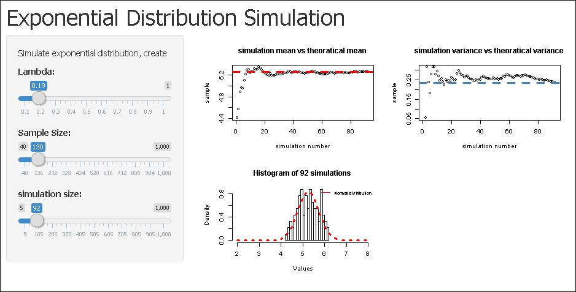

Law of large Number Simulation.md
========================================================
author: superpapper
date: 03/21/2015

Law of large Number
========================================================

In probability theory, the law of large numbers (LLN) is a theorem that describes the result of performing the same experiment a large number of times. In this project, we are trying to simulate the effect by plotting a sample of exponentially distributions.
You are going to see in the App as the simulation size increases:
- simulation mean approach theoratical mean
- simulation variance approach theoratical variance
- Distribution of sample mean approach normal distribution 

You could also see how the exponential distribution mean and variance changes as the lambda changes.

Simulation Code
========================================================
following code in the server.R take in the lamba, smaple size and simulation number from the slider

```r
      lambda <- input$lambda
      n  <- input$n
      sim_num    <- input$sim_num
      set.seed(1000)
       for (i in 1 : sim_num) {
         value=rexp(n,lambda)
         mns = c(mns, mean(value))
         
       }
       
       for (i in 1 : sim_num) {
         mean = c(mean, mean(mns[1:i]))
         var= c(var,var(mns[1:i]))
       }
```

The App
========================================================

 
You could change through three slider
- the exponential distribution lambda  
- the sample size   
- the simulation numbers

the result will automatically refresh on the three figures to the right.

About
========================================================

This app was developed for coursera class "Developing Data Products".

It is an extension of the first project of coursera class "Statistical Inteference"

It is written in R and you could get the source files in https://github.com/superpapper/Developing-Data-Products
